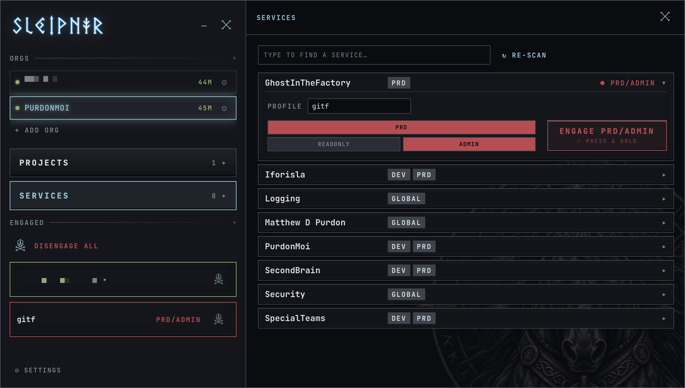
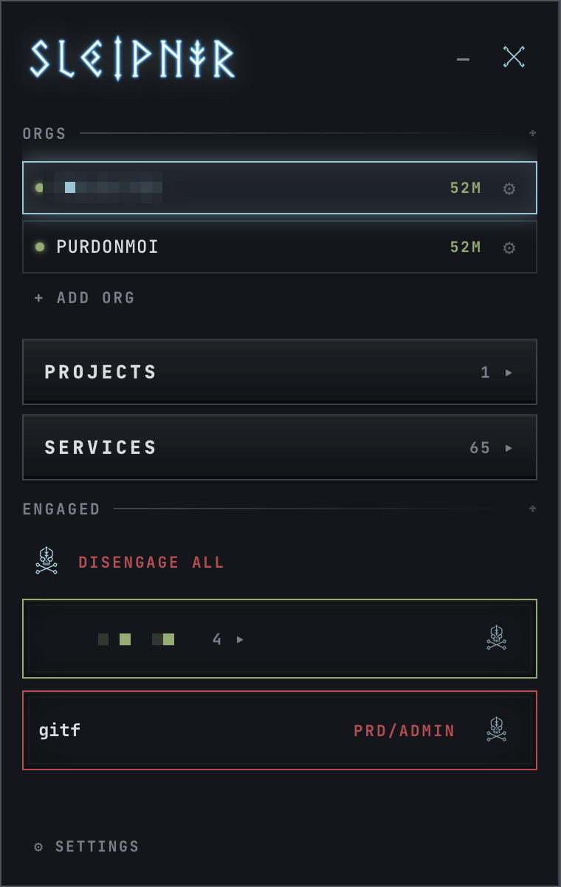
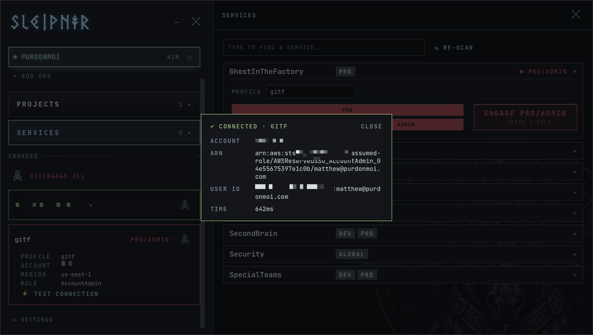

<p align="center">
  
</p>
<p align="center">
  
</p>

<p align="center">
  A Norse-themed AWS SSO credential manager for macOS — a Leapp replacement<br/>
  that wires itself up from your org's naming conventions.
</p>

<p align="center">
  
</p>

---

## Install

```sh
brew install --cask mpurdon/tap/sleipnir-aws
```

Apple Silicon only for now. Signed and notarized — no Gatekeeper
workarounds needed.

📖 **[Help docs →](https://mpurdon.github.io/sleipnir/)** — getting started,
discovery, projects, safety, and troubleshooting. The app carries the same
walkthroughs as guided tours under **⚙ SETTINGS → HELP**.

## What it does

- **Auto-discovery** — one login, one scan: sleipnir lists every account in
  your AWS organization and groups them into *services* from their naming
  convention (`Core Services Development/Staging/Production/Sandbox` → one
  service, four environments), with per-environment role picks in a review
  table before anything is imported.
- **Projects** — bundle the services you work on together and engage them
  as a unit: one click fetches role credentials for every member and
  delivers them as profiles in `~/.aws/credentials` — so terminals, SDKs,
  IDE plugins, and even sandboxed apps just work:
  `aws sts get-caller-identity --profile core-services`.
- **Honest sessions** — the SSO refresh token lives in the macOS Keychain,
  the hourly access token rotates silently, and engaged profiles' keys are
  refreshed in the background before they expire; the only login you ever
  see is your org's real SSO session boundary.
- **Safety by construction** — DISENGAGE is a real off-switch (the keys
  are physically removed from `~/.aws/credentials`); admin-on-production
  requires a press-and-hold, never a dismissable dialog; mode fallback
  (admin → poweruser → readonly) never escalates and the UI always shows
  the access you actually got.
- **Plays well with others** — the `~/.aws/config` editor is
  line-preserving and byte-faithful around stanzas it doesn't own, and it
  neutralizes (reversibly comments out) credential keys that would
  silently override an engagement.
- **⚡ Connection test** — verifies a profile through the *real* path:
  the AWS CLI reading your config and hitting STS — with the resulting
  ARN shown in-app.

<table>
  <tr>
    <td align="center" width="34%">
      
      <br/><sub>The rail — orgs, drawers, and everything currently engaged</sub>
    </td>
    <td align="center" width="66%">
      
      <br/><sub>⚡ Connection test — a real <code>sts get-caller-identity</code> round-trip</sub>
    </td>
  </tr>
</table>

## Development

Bun end-to-end (no Vite), Tauri 2, React 19, Rust.

```sh
bun install
bun run tauri dev     # dev app with hot reload
bun run tauri build   # release .app bundle
cargo test            # run from src-tauri/ — includes the discovery
                      # heuristic's structure-preserving 166-account fixture

bun run docs:serve    # help site at http://127.0.0.1:4318
```

The app icon is generated from `src-tauri/icons/app-icon-source.png` by
`scripts/gen_icons.py`. Check a candidate against the macOS grid and see it
at every size it will actually be rendered at — 16px included — with
`python3 scripts/check_icon.py <file>` before regenerating.

The help site is Markdown in `docs-src/`, built by `scripts/build-docs.ts`
and deployed to GitHub Pages on push. In-app tours live in `src/tour/`.

`sleipnir` on your PATH detaches from the terminal by default;
`sleipnir --foreground` keeps it attached with the log on stdout, which is
usually what you want while developing. `src-tauri/src/launch.rs` holds the
argument dispatch, and is where a future subcommand (a TUI, say) would hang.

A dev build wears a gold **DEV** badge and keeps its own state — config,
runtime state, credential cache, Keychain entries and log file all live
under `~/.sleipnir-dev` rather than `~/.sleipnir`, so it starts empty and
needs its own org and login. That is deliberate: both builds otherwise
share `~/.aws/credentials` and the background rotation tick, and a dev
window could disengage — strip keys from — profiles the installed app put
there. The split lives in `src-tauri/src/paths.rs`.

## Status

Early but daily-driven. Signed and notarized, with tag-driven releases
that publish to the Homebrew tap automatically.

### Roadmap

**Reaching people.** There is no update mechanism — no updater plugin, no
version check. Someone who installed at 0.1.5 stays on 0.1.5 and has no way
to learn otherwise, so every fix reaches a teammate only if they are told to
run `brew upgrade`. A launch-time check against the releases API is the
cheap fix; `tauri-plugin-updater` is the real one.

**A TUI.** `sleipnir` launches the GUI; a subcommand should open a terminal
interface over the same config and state — browse and engage services,
manage projects, see what is engaged, disengage. For anyone who lives in a
terminal that is a shorter path than reaching for a window, and it makes the
app usable over SSH, where the GUI cannot go. The argument dispatch in
`src-tauri/src/launch.rs` was written with this in mind: subcommands have a
home, and `creds` already proves the binary can run headless.

**Interface.**

- Drag one standalone engaged service onto another to create a project from
  the pair. Dragging a standalone onto an *existing* project already works.
- Pin PROJECTS and SERVICES in the rail. They scroll out of view under a
  long org list — the same cause as the settings footer, but pinning primary
  navigation is a layout decision rather than a bug fix.

**Model.** Per-environment profile names, so one service can be engaged at
two environments at once. Today a profile is one name holding one set of
keys, so `global-event-bus` is DEV or PRD, never both. Reference counting
covers two projects sharing a service at the *same* environment; this is the
case it cannot reach.

**Platform.** Universal (Intel) builds; Windows packaging. The Keychain
wrapper already speaks Windows Credential Manager.

**Housekeeping.** A dangling `v0.1.2` tag with no release behind it (the run
that died on a notarization 401), and two correctable `brew style` offenses
in the tap's `Formula/gitf.rb`.
